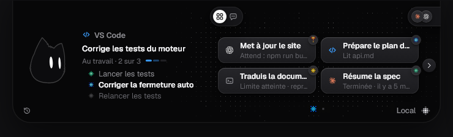
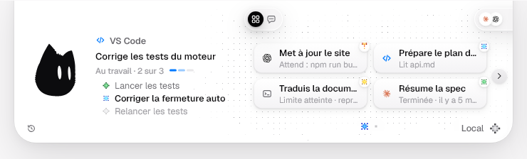
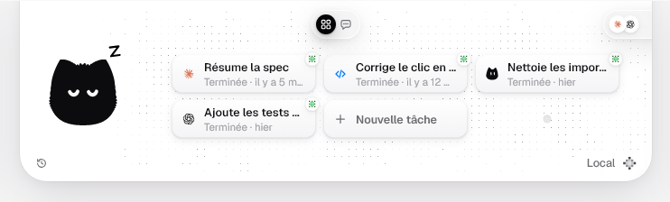
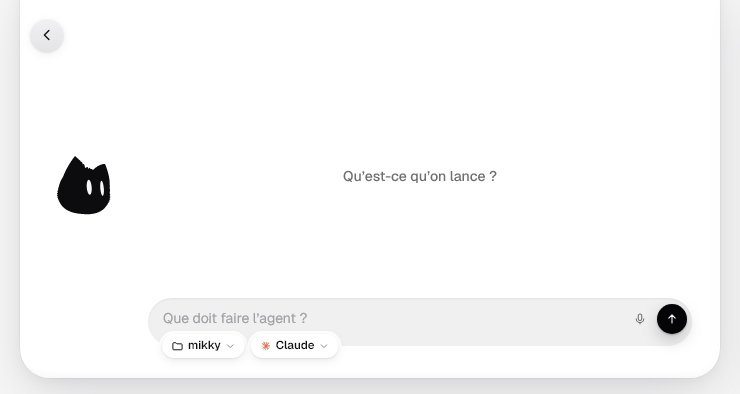
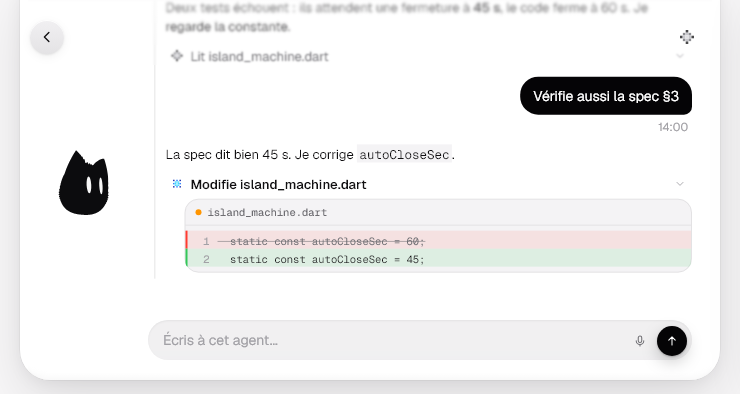
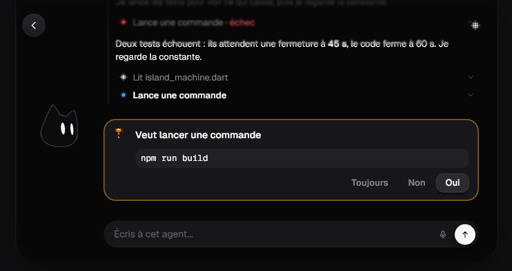
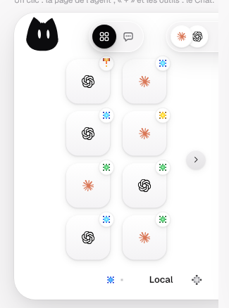
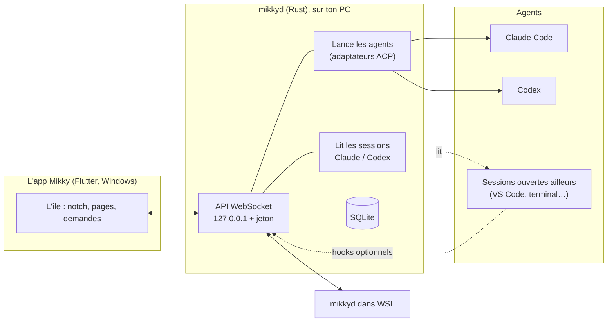
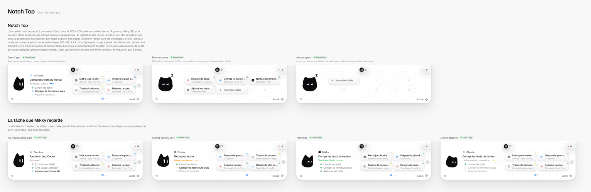
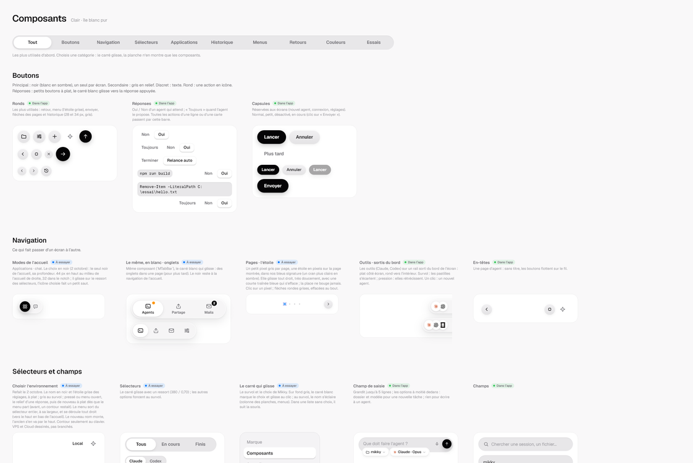

# Mikky

**Mikky est un petit chat noir aux grands yeux qui vit en haut de ton écran et veille sur tes agents de code.** Il lance et suit Claude Code et Codex, te montre où en est chaque tâche, et t'apporte leurs demandes (« je peux lancer `npm run build` ? ») pour que tu répondes d'un clic, sans fouiller dans tes terminaux.



> Projet personnel en cours, sous Windows aujourd'hui. Tout tourne **en local** : pas de compte, pas de serveur, pas de télémétrie.

---

## Ce que fait Mikky aujourd'hui

- **Il vit dans une île au bord de l'écran.** Fermée, c'est une petite pilule en haut au centre (ou un onglet sur le bord droit). Au survol, elle s'ouvre en **notch** : Mikky à gauche, et ce qui se passe.
- **Il regarde la dernière tâche au travail.** À côté de lui : le logiciel où elle tourne (VS Code, un terminal, l'app Claude ou Codex), son titre, son état, sa progression et ses étapes. Quand rien ne tourne, il s'endort.
- **Il montre toutes tes tâches comme des applications.** Chaque tuile donne le titre, ce que l'agent fait à l'instant et le logiciel. Les tâches qui attendent passent devant, les terminées restent un moment, le reste va dans l'historique.
- **Il lance des agents.** Le mode Chat (ou « + ») ouvre un chat vide : un dossier, un modèle, une consigne, et l'agent démarre sous Windows ou dans WSL. Le chat devient alors la conversation de l'agent.
- **Il suit aussi les sessions lancées ailleurs.** Une session Claude Code ouverte dans VS Code ou un terminal apparaît d'elle-même. Mikky lit son activité sans la toucher.
- **Il t'apporte les demandes.** Quand un agent veut lancer une commande ou te pose une question, Mikky sort de l'île avec la demande et son contexte : la tâche, l'étape, ce que l'agent vient de dire et de faire. Tu réponds **Oui / Non / Toujours**. Pour les sessions extérieures, des *hooks* Claude Code et Codex optionnels font passer leurs demandes par Mikky ; leur installation montre toujours le changement avant de l'écrire.
- **Il montre la conversation d'un agent.** Dans la page d'un agent, chaque tâche déroule dans l'ordre ce que l'agent a dit et fait (fichiers lus, modifiés, commandes, avec le code). Sa réponse se lit comme une note. On peut lui écrire pour continuer.
- **Il suit les limites d'abonnement.** Quand Claude ou Codex atteint sa limite, Mikky dit quand elle se lève. Il peut relancer l'agent automatiquement à ce moment-là.
- **Il réagit et fait du bruit, un peu.** Mikky change d'expression avec ses agents, joue des sons discrets (à fournir soi-même) et envoie des notifications Windows. Trois raccourcis globaux : **Ctrl + Alt + A** pour la demande en attente, **Ctrl + Alt + Espace** pour ouvrir ou fermer, **Ctrl + Alt + M** pour couper le son.

Mikky n'est **pas** un agent ni un harnais d'agents : il n'a pas de modèle à lui. Il lance les outils officiels (Claude Code, Codex) avec **tes abonnements**, sans clé d'API, et il les suit.

## En images

Toutes les images viennent des **planches** de Mikky (voir plus bas) : ce sont les vrais écrans de l'app, nourris par des sessions inventées.

| Le notch, une tâche au travail | Rien en cours : Mikky dort |
|---|---|
|  |  |

| Un nouveau chat | La page d'un agent au travail |
|---|---|
|  |  |

| Une demande à valider | À droite de l'écran |
|---|---|
|  |  |

## Le but

L'idée de départ : avoir près de soi un **compagnon simple**, un peu comme [Paperclip](https://github.com/paperclipai/paperclip), mais qui ne remplace aucun outil. On lance ses agents où on veut, et Mikky :

1. **voit** tout ce qui tourne, d'un coup d'œil, sans changer de fenêtre ;
2. **apporte** ce qui a besoin de toi, avec assez de contexte pour répondre sans aller voir ;
3. **reste discret** le reste du temps : 0 % de processeur quand l'île est cachée.

La suite prévue, dans l'ordre : de nouveaux outils, des agents qui se parlent par Mikky (au sein d'une équipe, avec ton accord au-delà), un VPS relié par un tunnel SSH, puis une app mobile. Le détail est dans la [feuille de route](docs/superpowers/reprise.md#prochaines-étapes-dans-lordre) et les [idées](docs/superpowers/idees.md).

## Comment ça marche



- **L'app Flutter n'est qu'un écran.** L'île est une fenêtre transparente au-dessus des autres, avec une forme dessinée par un *shader*, et les clics passent au travers là où il n'y a rien. Fermer l'app n'arrête aucun agent.
- **`mikkyd`, le moteur en Rust, fait tout le travail d'agents.**
  - Il lance Claude Code et Codex par leurs adaptateurs ACP (`claude-agent-acp`, `codex-acp`), sous Windows ou dans WSL, chacun dans un *job object* qui permet de tout arrêter proprement.
  - Il garde les permissions et les questions même quand aucun écran n'est ouvert.
  - Il lit les fichiers de session de Claude et de Codex pour suivre aussi les sessions lancées ailleurs, et repère le logiciel où elles tournent.
  - Il range ses métadonnées dans SQLite.
- **L'app et le moteur se parlent en local.** Le WebSocket n'écoute que sur `127.0.0.1`, protégé par un jeton rangé dans le coffre de Windows. WSL a son propre moteur, relié à celui de Windows.
- **Les hooks restent optionnels.** `mikky-hook` est un petit relais que Claude Code et Codex appellent pour faire passer leurs demandes par Mikky. Il ne bloque jamais l'agent : sans réponse, il rend la main.

| Dossier | Contenu |
|---|---|
| [`app/`](app/) | L'app Flutter : l'île, le notch, les pages, les planches (`lib/boards/`) |
| [`daemon/`](daemon/) | Le moteur Rust : `mikkyd`, `mikky-acp`, `mikky-hook` |
| [`packages/mikky_engine/`](packages/mikky_engine/) | Le cœur en Dart pur : Mikky, l'île, les sessions et leurs événements |
| [`packages/mikky_agents/`](packages/mikky_agents/) | Le client de `mikkyd` : ce que l'île et l'accueil affichent |
| [`docs/superpowers/`](docs/superpowers/) | Où on en est, le design, les idées, les specs et les plans |

## Les planches

Le design de Mikky se décide sur des **planches**, comme dans Figma, mais vivantes : ce sont les vrais composants et écrans de l'app, qu'on peut cliquer, dans chacun de leurs états, en clair et en sombre.



- Chaque cadre porte une étiquette : **Dans l'app** (le vrai écran), **Essai** (pas encore choisi) ou **À essayer** (une zone où cliquer et jouer). Un filtre permet de n'afficher que l'une d'elles.
- Les planches : Marque, Composants, Petite île, Notch Top, Notch Right, Accueil Right, Agent, Messages, Technique (le fonctionnement du moteur expliqué).
- Une image de chaque planche sert de test (`app/test/goldens/boards/`) : un changement visuel involontaire fait échouer les tests.



## Installer et lancer

**Pour compiler :** Flutter pour Windows, Visual Studio avec la charge C++, Cargo sous Windows, et Rust dans WSL `Ubuntu`.

**Pour les agents :** Node.js 22 ou plus sous Windows, Claude Code et/ou Codex installés et connectés avec leur abonnement. Le moteur installe ses adaptateurs ACP au premier lancement d'un agent ; sous WSL, il prépare aussi son propre Node.

```powershell
.\scripts\Build-Windows.ps1          # construit un bundle daté dans dist\
.\Start-Mikky.ps1                    # l'île
.\Start-Mikky.ps1 -Boards            # les planches
.\Start-Mikky.ps1 -Boards -Live      # les planches en direct, rechargées à chaque fichier enregistré
.\scripts\Update-Boards.ps1          # refait les images des planches, reconstruit et les rouvre
.\Start-Mikky.ps1 -InstallStartup    # l'île et le moteur au démarrage de Windows
```

- **Le bundle :** il se trouve dans `dist/Mikky-<date>/`. Garder `data`, les DLL et les exécutables Rust à côté de `mikky.exe`.
- **WSL est facultatif :** s'il n'est pas disponible, les agents Windows marchent quand même.
- **Mises à jour du moteur :** un moteur en service n'est remplacé que s'il ne pilote aucun agent.
- **Les sons ne sont pas fournis :** le dépôt est public et les sons utilisés ne sont pas à nous. Mettre ses propres `.mp3` dans `app/assets/sounds/` (voir son [README](app/assets/sounds/README.md)). Sans eux, Mikky reste silencieux.

## Vérifier le code

| Où | Commandes |
|---|---|
| `daemon/` | `cargo build`, `cargo test --workspace` |
| `packages/mikky_engine/`, `packages/mikky_agents/` | `dart analyze`, `dart test` |
| `app/` | `flutter analyze`, `flutter test` (dont les images des planches) |

Les tests relisent de vraies sessions Claude et Codex enregistrées. Le scénario WSL s'active avec `MIKKY_TEST_WSL=1`.

## Confidentialité

- Pas de télémétrie, pas de compte, pas de serveur : tout reste sur ta machine.
- Les secrets (le jeton du moteur) sont dans le coffre de Windows, jamais sur le disque ni dans git.
- Mikky lit les fichiers de session de Claude et de Codex sur ta machine, pour te les montrer ; rien ne part ailleurs.
- Les permissions vont toujours à toi par défaut. Le mode automatique n'existe que si tu le choisis pour un lancement.

## Mesures

Relevées au début du projet (fin septembre 2026), sur un écran 1920 × 1080 à 100 % et 12 cœurs :

| Jalon | Île cachée (CPU) | Île ouverte (CPU) | Mémoire |
|---|---|---|---|
| J0, 28 septembre | 0,03 % du total | — | 73 Mo |
| Mikky animé + shader, 28 septembre | 0,013 % du total | 0,85 % du total (10 % d'un cœur) | 99 Mo (*working set*), 142 Mo privés |

## Pour aller plus loin

- [Où on en est](docs/superpowers/reprise.md) : l'état du projet, ce qui reste, les pièges connus.
- [Le design](docs/superpowers/design.md) : la direction artistique et chaque décision, datée.
- [La spec de `mikkyd`](docs/superpowers/specs/2026-09-30-mikkyd-design.md) : le moteur, la sécurité, les étapes.
- [`CLAUDE.md`](CLAUDE.md) : le guide pour les agents qui travaillent sur ce dépôt.
